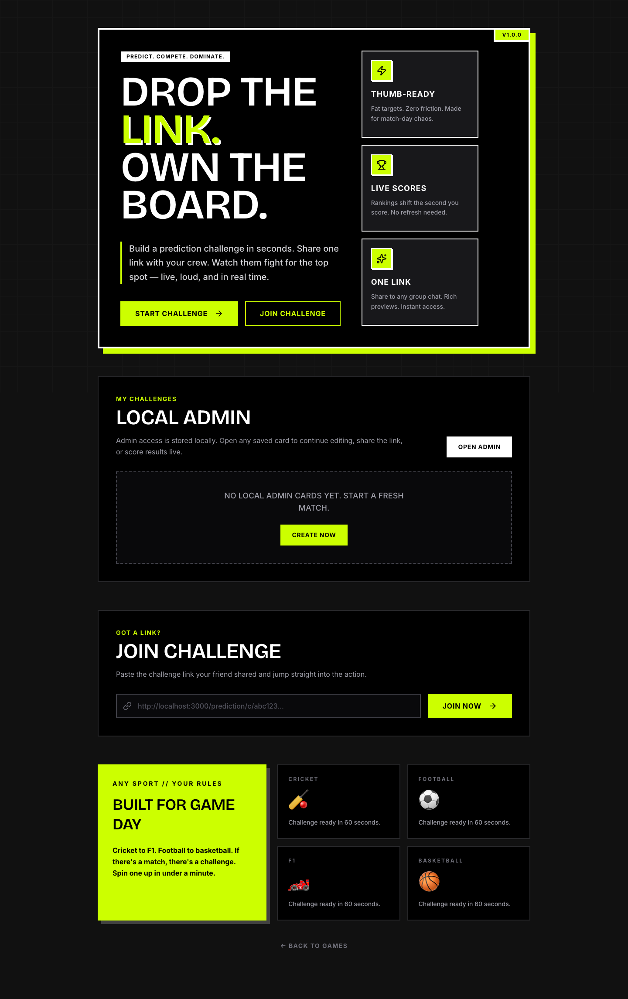
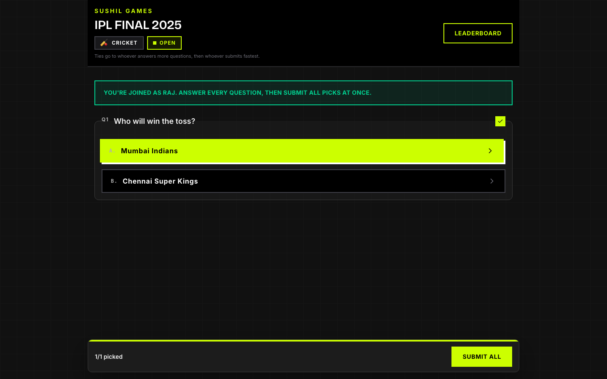
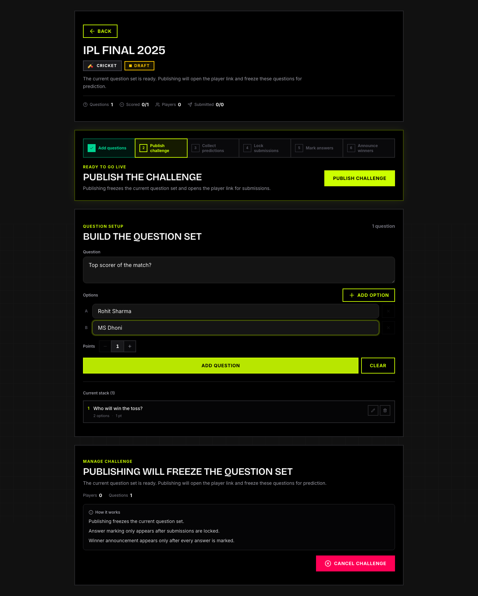
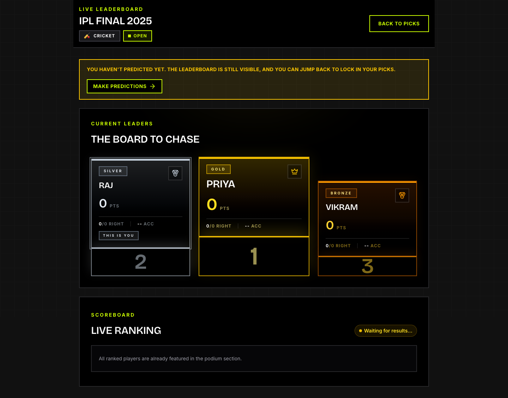
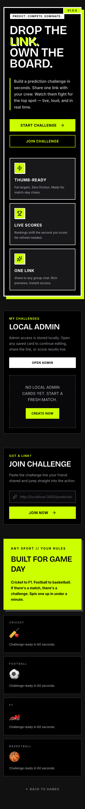

# Prediction Game

> Drop the link. Own the board.

A real-time sports prediction platform. Create a challenge in under a minute, share one link with your crew, and watch the live leaderboard shift as answers come in.

**[Play now →](https://play.sushilkamble.com/prediction)**

---

## Screenshots

<table>
  <tr>
    <td></td>
    <td></td>
  </tr>
  <tr>
    <td></td>
    <td></td>
  </tr>
</table>

<details>
  <summary>Mobile view</summary>
  <br />
  
</details>

---

## Features

- **Create in 60 seconds** — title, sport, questions, and you're live
- **One shareable link** — rich Open Graph previews work in every group chat
- **No account required** — players join with just a nickname, no sign-up friction
- **Real-time leaderboard** — live podium (Gold / Silver / Bronze) with instant ranking updates
- **Challenge lifecycle** — Draft → Open → Scoring → Closed, fully admin-controlled
- **Question builder** — multiple-choice questions with configurable point values
- **Lock & score** — admin locks submissions after the match, marks correct answers, announces winners
- **Multi-sport** — Cricket, Football, F1, Basketball, or any custom sport
- **Mobile-first** — fat touch targets and thumb-friendly layout for match-day use
- **Local admin storage** — challenge admin keys are stored in the browser; no backend auth needed

---

## How It Works

```
Admin                           Players
  │                                │
  ├─ Create challenge              │
  ├─ Add prediction questions      │
  ├─ Publish → share link ────────►├─ Join with a nickname
  │                                ├─ Pick answers to each question
  │                                └─ Submit all picks at once
  │
  ├─ Lock submissions (match ends)
  ├─ Mark correct answers
  └─ Announce winners → leaderboard updates live
```

1. **Admin creates** a challenge with a set of multiple-choice questions.
2. **Admin publishes** — this freezes the question set and opens the player link.
3. **Players join** via the shared link, enter a nickname, and lock in their picks.
4. **After the match**, admin locks submissions, marks each answer, and announces winners.
5. **Leaderboard** updates in real time as answers are scored.

---

## Tech Stack

| Layer | Technology |
|---|---|
| Framework | [TanStack Start](https://tanstack.com/start) (React 19 + SSR) |
| Routing | [TanStack Router](https://tanstack.com/router) (file-based) |
| Backend / Database | [Convex](https://convex.dev) (real-time, reactive) |
| Styling | [Tailwind CSS v4](https://tailwindcss.com) |
| UI Components | [shadcn/ui](https://ui.shadcn.com) (Radix UI primitives) |
| Deployment | [Cloudflare Workers](https://workers.cloudflare.com) via Wrangler |
| Language | TypeScript |
| Testing | [Vitest](https://vitest.dev) + React Testing Library |

---

## Local Development

```bash
# Install dependencies
pnpm install

# Start Convex dev server (in one terminal)
pnpm dlx convex dev

# Start the app (in another terminal)
pnpm dev
```

Copy `.env.local` and point `VITE_CONVEX_URL` at your dev deployment.

```bash
# Run tests
pnpm test

# Type-check
pnpm typecheck

# Lint
pnpm lint
```

## Deployment

```bash
pnpm deploy
```

This runs `convex deploy` + `vite build` + `wrangler deploy` in a single command.
